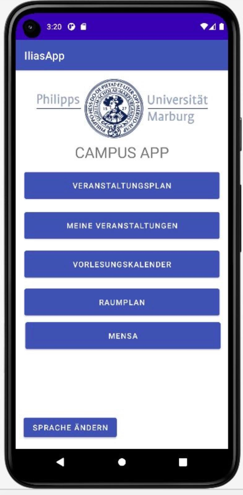
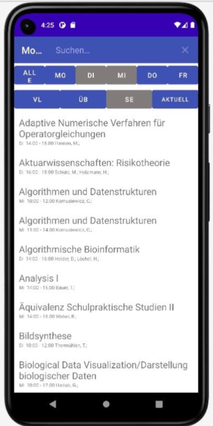
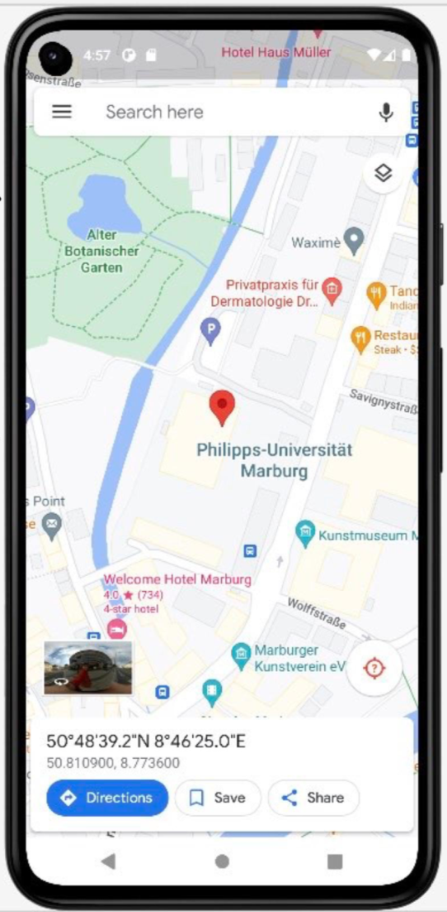

Select Features            |  Search for Classes | Navigate on Campus
:-------------------------:|:-------------------------: |:-------------------------:
  |   | 

## Instructions:
The app was developed during a software internship at the University of Marburg and some functionalities use mock-data.
You can log in with your students username and password. If you don't have a university account you can simply enter "test" as username.

## 1. Kurzbeschreibung der Komponenten

**1.1. Zentrale Android Activities:**
- **HomeScreen**:
Hauptmenü — stellt Buttons für alle Funktionsbereiche der App dar.
- **Modulsuche**:
Verwaltet den gesamten Modulkatalog in einem RecyclerView. Ein SearchView und mehrere Filterfunktionen machen die Modulliste durchsuchbar.
- **MeineVeranstaltungen**:
Stellt alle Module dar, die in der sqLite Datenbank gespeichert wurden.
- **Kalender**:
Stellt einen Kalender dar mit allen in MeineVeranstaltungen gespeicherten Modulen.
- **RecyclerViewAdapter**:
Setzt das ViewHolder Pattern um.
Der Adapter greift auf die Daten in ModulSearchData zu und übergibt sie dem ViewHolder im RecyclerView um effizientes Recycling zu ermöglichen.
- **RaumDetails**:
Darstellung aller für den User relevanten Informationen zu einem ausgewählten Modul. Greift auf eine sqLite Datenbank zu in der um Module zur Darstellung in MeineVeranstaltungen gespeichert oder wieder entfernt werden.
- **RaumSuche**:
Darstellung der Raumdetails und Adressen von Uni Gebäuden.

**1.2. Data-Package:**

Um die Datenverwaltung von den Android Activities mit der Darstellung und Programmlogik etwas zu trennen, haben wir eine separate Klassenstruktur für die Datenverwaltung implementiert, die installiert werden kann um an den benötigten stellen leichter wiederverwendet werden zu können.

- **ModulSearchData**: Datenhaltungsklasse, welche die Modulinformationen von der Modulliste.xls mithilfe von JSoup einliest und aus jeder Zeile eine Modul-Instanz erzeugt.
- **Modul**:
Modelliert ein Modul im Veranstaltungskatalog.
- **Gebäude**:
Modelliert ein Uni-Gebäude für die Raumsuche.
- **DataAPIRequest**:
Stellt einen request an die getCourseXML Methode der Ilias-test API.
- **UserRequest**:
Stellt einen request an die searchUser Methode der Ilias-test API.
- **FeedReaderContract**:
Legt die Struktur der DatenBank für gespeicherte Module fest.
- **FeedReaderDbHelper**:
Subklasse von SQLiteOpenHelper. Stellt sicher, dass Operationen wie die Erzeugung und Update der Datenbank nur ausgeführt werden, wenn nötig und nicht beim Start der App.

 **1.3. Login-Package:**
 
Für den Login-Prozess wurde eine Abwandlung des (sehr komplizierten) Android Studio Templates für Login-Activities verwendet.

- **Login** :
Android Activity, die den Login-Bildschirm darstellt, Passwort und Nutzername an LoginRepository weitergibt und
die UI mit den User-Daten ausfüllt, wenn die Validierung erfolgreich ist.
- **LoginRepository**:
Gibt die Userinformationen zur Validierung an LoginDataSource weiter und gibt als Ergebnis eine Instanz von LoginResult an Login zurück.
- **LoginDataSource**:
Sendet einen login request an die Ilias-test API. Bei erfolgreicher Validierung der Nutzerdaten durch die API wird eine LoggedInUser Instanz zurückgegeben.
- **LoggedInUser**:
Modelliert einen validen Nutzer mit Nutzerdaten und einer validen Session ID.
- **LoginResult**:
Modelliert einen erfolgreichen oder nicht erfolgreichen Login-Versuch über die Subklassen (1) Success die ein LoggedInUser Objekt verwaltet und (2) Error, die eine Exception als Begründung für den Fehlschlag beinhaltet.

